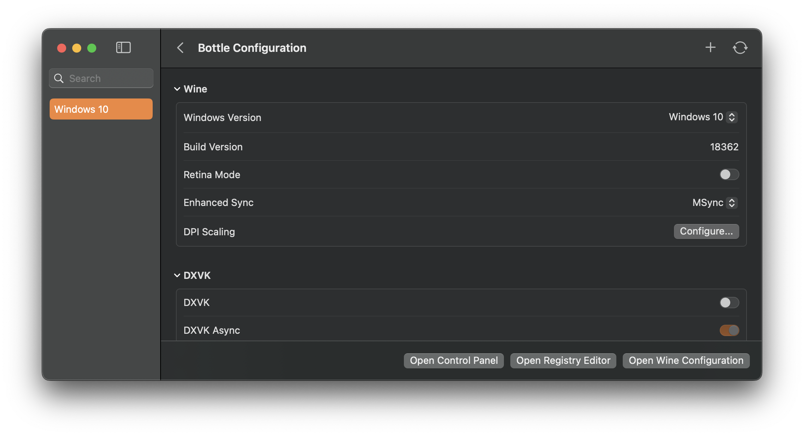
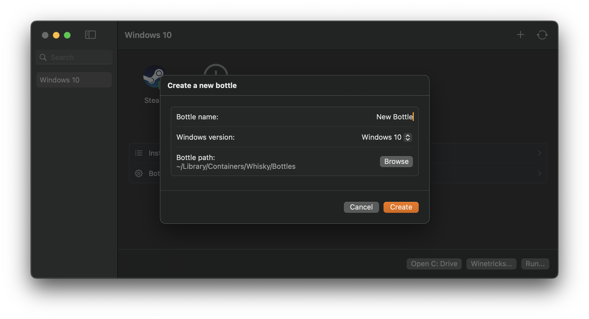
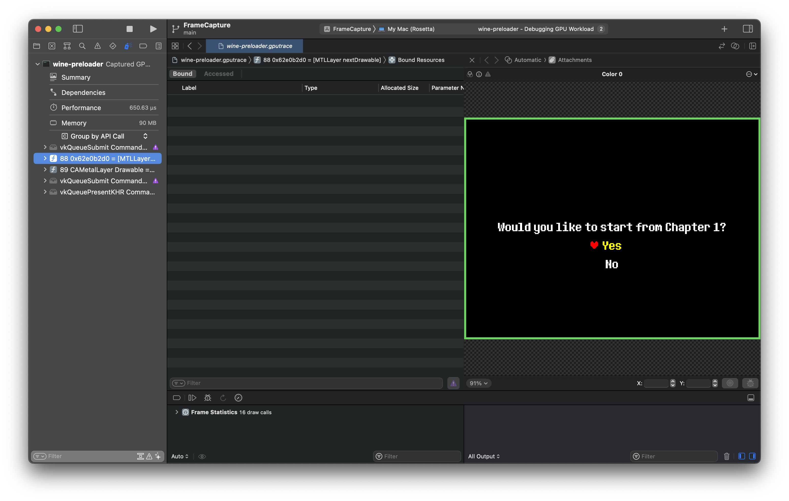

  # Whisky 🥃
  *Wine but a bit stronger*

  > **Active community fork.** The original [whisky-app/whisky](https://github.com/whisky-app/whisky)
  > was archived on April 9, 2025 with a final maintenance notice. This fork, maintained by
  > [@frankea](https://github.com/frankea), continues development — addressing the backlog of
  > upstream issues and adding new functionality. Not affiliated with the original project or
  > getwhisky.app.

  
  
  
  

## Overview

Whisky provides a clean and easy-to-use graphical wrapper for Wine built in native SwiftUI. You can make and manage bottles, install and run Windows apps and games, and unlock the full potential of your Mac with no technical knowledge required.

*Familiar UI that integrates seamlessly with macOS*

  

  *One-click bottle creation and management*

*Debug and profile with ease*

---

## Key Features

- **Wine 11.0** - Latest stable Wine with improved compatibility and networking
- **Launcher Compatibility** - Built-in support for Steam, Epic, EA App, Rockstar, Battle.net, and more
- **Controller Support** - SDL environment variable controls for gamepad detection and mapping issues
- **Stability Diagnostics** - One-click diagnostic reports for troubleshooting crashes and freezes
- **Native SwiftUI** - Beautiful, familiar macOS interface

## System Requirements

- **CPU**: Apple Silicon (M-series chips)
- **OS**: macOS Sequoia 15.0 or later

## Installation

1. Download the latest **[Whisky-X.Y.Z.dmg](https://github.com/frankea/Whisky/releases/latest)** (signed and notarized — Gatekeeper-approved).
2. Open the DMG and drag **Whisky.app** to **/Applications**.
3. Launch Whisky. On first run it downloads the Wine runtime (~313 MB) and sets up your default bottle.

In-app updates are delivered through Sparkle from `https://frankea.github.io/Whisky/appcast.xml`.

> **Note:** This fork is not yet available via Homebrew. `brew install --cask whisky` still installs the archived original.

### Migrating from the original Whisky

The original [whisky-app/whisky](https://github.com/whisky-app/whisky) was archived on **April 9, 2025** with a final maintenance notice. If you're running it today, you're on a stale build with no path forward for new fixes. This fork picks up where the upstream left off — version `3.0.1` shipped 54 requirements covering the 10 categories of upstream issue tracking (#40–#50).

To switch:

1. Quit the original Whisky app.
2. Drag the existing **/Applications/Whisky.app** to the Trash. Your bottles in `~/Library/Containers/com.isaacmarovitz.Whisky/` are untouched, but this fork uses a different bundle identifier (`com.franke.Whisky`) so it will not see them automatically — export bottles you want to keep first via the original app's **Bottle → Export** menu.
3. Install this fork using the steps above.
4. Re-import any exported bottles through **File → Import Bottle** in the new app.

If you have no critical bottles, you can skip the export — the new app will create a fresh bottle on first launch.

## Documentation

WhiskyKit, the core framework powering Whisky, has comprehensive API documentation:

- **[WhiskyKit API Documentation](https://frankea.github.io/Whisky/documentation/whiskykit/)** - Full API reference with usage examples
- **[Getting Started Guide](https://frankea.github.io/Whisky/documentation/whiskykit/gettingstarted)** - Learn how to integrate WhiskyKit
- **[Architecture Overview](https://frankea.github.io/Whisky/documentation/whiskykit/architecture)** - Understand how WhiskyKit components work together

### Troubleshooting

- **[Launcher Troubleshooting](docs/LauncherTroubleshooting.md)** - Fix issues with Steam, Epic, Battle.net, etc.
- **[Steam Compatibility Guide](docs/SteamCompatibility.md)** - Detailed guide for Steam on Whisky
- **[Stability Troubleshooting](docs/StabilityTroubleshooting.md)** - Diagnose crashes, freezes, reboots, and kernel panics
- **Controller Issues** - Enable "Controller Compatibility Mode" in Bottle Config → Controller & Input
- **[Game Support Wiki](https://github.com/frankea/Whisky/wiki/Game-Support)** - Community-maintained game compatibility list

### Upstream issue audit

Per-issue accounting of how this fork addresses the open issues from the
archived upstream repo. Read [docs/AUDIT.md](docs/AUDIT.md) for the
methodology — including how to read the `addressed-direct` vs
`addressed-categorical` distinction and what `unverified` GameDB entries
actually mean.

---

## Credits & Acknowledgments

Whisky is possible thanks to the magic of several projects:

- [msync](https://github.com/marzent/wine-msync) by marzent
- [DXVK-macOS](https://github.com/Gcenx/DXVK-macOS) by Gcenx and doitsujin
- [MoltenVK](https://github.com/KhronosGroup/MoltenVK) by KhronosGroup
- [Sparkle](https://github.com/sparkle-project/Sparkle) by sparkle-project
- [SemanticVersion](https://github.com/SwiftPackageIndex/SemanticVersion) by SwiftPackageIndex
- [swift-argument-parser](https://github.com/apple/swift-argument-parser) by Apple
- [CrossOver](https://www.codeweavers.com/crossover) by CodeWeavers and WineHQ
- D3DMetal by Apple

Special thanks to Gcenx, ohaiibuzzle, Nat Brown, and [Isaac Marovitz](https://github.com/IsaacMarovitz) (original author) for their support and contributions!

---

<table>
  <tr>
    <td>
        <picture>
          <source media="(prefers-color-scheme: dark)" srcset="./images/cw-dark.png">
          
        </picture>
    </td>
    <td>
        Whisky doesn't exist without CrossOver. Support the work of CodeWeavers using our <a href="https://www.codeweavers.com/store?ad=1010">affiliate link</a>.
    </td>
  </tr>
</table>
