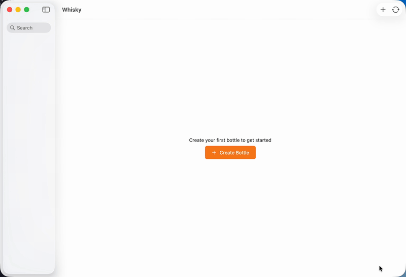
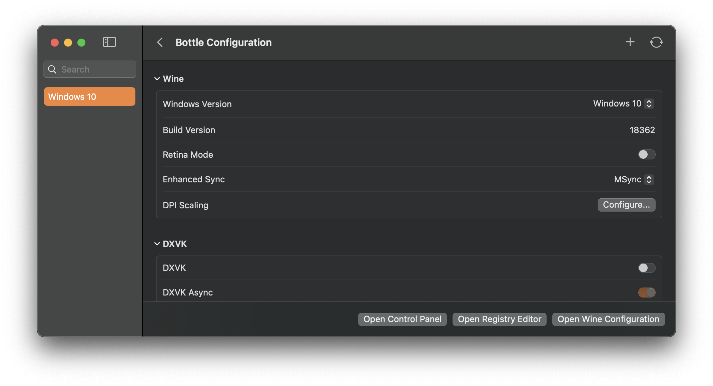
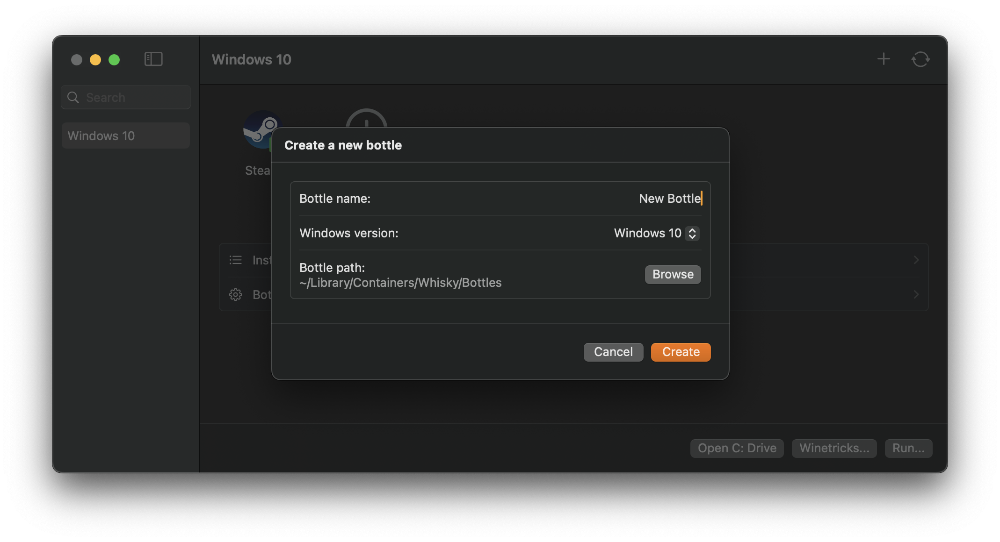
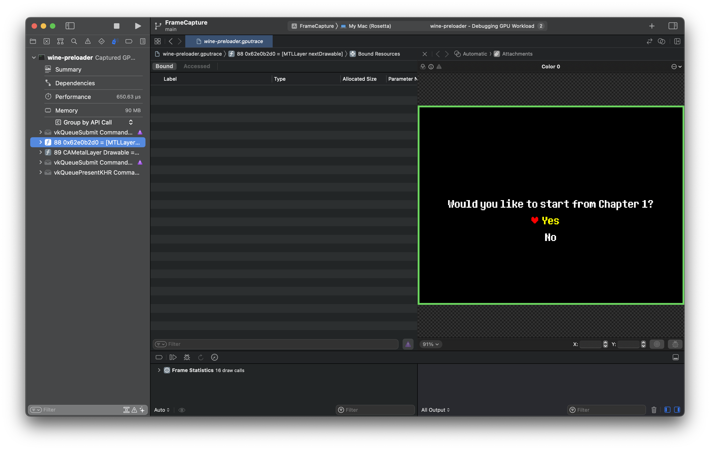

<div align="center">

  # Whisky 🥃
  *Wine but a bit stronger*

  > **Active community fork.** The original [whisky-app/whisky](https://github.com/whisky-app/whisky)
  > was archived on April 9, 2025 with a final maintenance notice. This fork, maintained by
  > [@frankea](https://github.com/frankea), continues development — addressing the backlog of
  > upstream issues and adding new functionality. Not affiliated with the original project or
  > getwhisky.app.

  
  [](https://codecov.io/gh/frankea/Whisky)
  [](https://github.com/frankea/Whisky/releases)
  [](https://github.com/frankea/Whisky/releases/latest)
  [](https://github.com/frankea/Whisky/issues)
  [](https://frankea.github.io/Whisky/documentation/whiskykit/)
</div>

## Overview

Whisky provides a clean and easy-to-use graphical wrapper for Wine built in native SwiftUI. You can make and manage bottles, install and run Windows apps and games, and unlock the full potential of your Mac with no technical knowledge required.





*Familiar UI that integrates seamlessly with macOS*

<div align="right">
  

  *One-click bottle creation and management*
</div>



*Debug and profile with ease*

---

## Key Features

- **Wine 11.0** - Latest stable Wine with improved compatibility and networking
- **Launcher Compatibility** - Built-in support for Steam, Epic, EA App, Rockstar, Battle.net, and more
- **Controller Support** - SDL environment variable controls for gamepad detection and mapping issues
- **Stability Diagnostics** - One-click diagnostic reports for troubleshooting crashes and freezes
- **Native SwiftUI** - Beautiful, familiar macOS interface

## System Requirements

- **CPU**: Apple Silicon (M-series chips)
- **OS**: macOS Sequoia 15.0 or later

## Installation

### Homebrew (recommended)

```sh
brew install --cask frankea/whisky/whisky
```

This taps [frankea/homebrew-whisky](https://github.com/frankea/homebrew-whisky) and installs the latest signed/notarized DMG. `brew upgrade --cask` picks up new releases.

> The default `brew install --cask whisky` still installs the **archived original** (last release April 2025) and always will until that cask is updated. Use the qualified `frankea/whisky/whisky` form to get this fork.

### Manual

1. Download the latest **[Whisky-X.Y.Z.dmg](https://github.com/frankea/Whisky/releases/latest)** (signed and notarized — Gatekeeper-approved).
2. Open the DMG and drag **Whisky.app** to **/Applications**.
3. Launch Whisky. On first run it downloads the Wine runtime (~313 MB) and sets up your default bottle.

In-app updates are delivered through Sparkle from `https://frankea.github.io/Whisky/appcast.xml`.

### Migrating from the original Whisky

The original [whisky-app/whisky](https://github.com/whisky-app/whisky) was archived on **April 9, 2025** with a final maintenance notice. If you're running it today, you're on a stale build with no path forward for new fixes. This fork picks up where the upstream left off — version `3.0.1` shipped 54 requirements covering the 10 categories of upstream issue tracking (#40–#50).

To switch:

1. Install this fork: `brew install --cask frankea/whisky/whisky` or follow the manual steps above.
2. Open it and choose **File → Migrate from the Original Whisky**. It finds the bottles the original app left in `~/Library/Containers/com.isaacmarovitz.Whisky/` and imports the ones you pick. Bottles are referenced **in place** — nothing is moved or copied — so the original app keeps working if you'd like to keep it around.
3. *(Optional)* Once you're happy, remove the original app: drag **/Applications/Whisky.app** to the Trash, or `brew uninstall --cask whisky` if you installed it via Homebrew. Your bottles stay put.

The original app uses a different bundle identifier (`com.franke.Whisky` here vs. `com.isaacmarovitz.Whisky`), which is why bottles aren't shared automatically. The old **Bottle → Export** / **File → Import Bottle** route still works if you'd rather move bottles by hand or onto another Mac. With no critical bottles, you can skip migration entirely — the new app creates a fresh bottle on first launch.

## Telemetry (opt-in)

Whisky sends **no data by default**. During first-run setup you can opt in to
anonymous usage telemetry — a checkbox that is **off** unless you tick it, and a
toggle you can change anytime in **Settings → Privacy**.

When (and only when) enabled, Whisky sends five events covering the first-run
funnel, so the maintainer can see where new installs fail:

| Event | Properties |
| --- | --- |
| `runtime_install_started` | — |
| `runtime_install_succeeded` | — |
| `runtime_install_failed` | `reason`: one of `download_failed`, `verify_failed`, `tarball_missing`, `extract_failed`, `runtime_incomplete` |
| `first_bottle_created` | — |
| `first_program_launch_attempted` | — |

`runtime_install_started` is sent once per setup attempt; the `_succeeded` /
`_failed` events are sent per install attempt (so retries are counted). The two
`first_…` events are sent at most once per install.

No personal data, file names, paths, raw error text, or identifiers tied to you
are ever sent. Events carry a random per-install anonymous ID (reset if you opt
out). Every event Whisky can send is the list above, and all of it is declared in
one file, [`Whisky/Utils/Telemetry.swift`](Whisky/Utils/Telemetry.swift), with
every automatic-capture feature of the analytics SDK disabled and no person
profile ever created (`identify()` is never called). Each event also carries the
SDK's standard context — app and macOS version, hardware model, locale, and more;
see [SECURITY.md](SECURITY.md) for the full list. Like any HTTPS request,
PostHog's ingestion sees the connecting IP (GeoIP enrichment is disabled); none
of this is tied to your identity.

## Documentation

- **[Support](docs/SUPPORT.md)** - Where to file bugs and what to expect from a single-maintainer fork
- **[Governance & continuity](docs/GOVERNANCE.md)** - Who maintains this and the honest bus-factor situation
- **[Runtime dependencies](docs/DEPENDENCIES.md)** - The bundled Wine/DXVK/D3DMetal/DXMT versions and their upstream sources

WhiskyKit, the core framework powering Whisky, has comprehensive API documentation:

- **[WhiskyKit API Documentation](https://frankea.github.io/Whisky/documentation/whiskykit/)** - Full API reference with usage examples
- **[Getting Started Guide](https://frankea.github.io/Whisky/documentation/whiskykit/gettingstarted)** - Learn how to integrate WhiskyKit
- **[Architecture Overview](https://frankea.github.io/Whisky/documentation/whiskykit/architecture)** - Understand how WhiskyKit components work together

### Troubleshooting

- **[Launcher Troubleshooting](docs/LauncherTroubleshooting.md)** - Fix issues with Steam, Epic, Battle.net, etc.
- **[Steam Compatibility Guide](docs/SteamCompatibility.md)** - Detailed guide for Steam on Whisky
- **[Stability Troubleshooting](docs/StabilityTroubleshooting.md)** - Diagnose crashes, freezes, reboots, and kernel panics
- **Controller Issues** - Enable "Controller Compatibility Mode" in Bottle Config → Controller & Input
- **[Game Configurations](https://github.com/frankea/Whisky/blob/main/WhiskyKit/Sources/WhiskyKit/GameDatabase/Resources/GameDB.json)** - 80+ curated per-game compatibility configs, also browsable in-app under Game Configurations

### Upstream issue audit

Per-issue accounting of how this fork addresses the open issues from the
archived upstream repo. Read [docs/AUDIT.md](docs/AUDIT.md) for the
methodology — including how to read the `addressed-direct` vs
`addressed-categorical` distinction and what `unverified` GameDB entries
actually mean.

### Test coverage

The Coverage badge above reports line coverage for **WhiskyKit only** —
the framework that holds the bottle, Wine, GameDB, and PE-parser logic.
The SwiftUI app target (`Whisky/`), `WhiskyCmd`, and `WhiskyThumbnail`
aren't measured because CI runs `swift test --enable-code-coverage`
against the WhiskyKit Swift package per
[`.github/workflows/CI.yml`](.github/workflows/CI.yml). Read the badge as
"WhiskyKit unit-test coverage," not full-app coverage.

WhiskyUITests gives behavioural coverage of the SwiftUI surface (toolbar,
create-bottle sheet, fixture-dependent flows). CI now runs them with
`-enableCodeCoverage YES` and uploads the resulting app-target coverage to
Codecov under a separate `whiskyapp` flag (best-effort — the upload never gates
CI). Because UI tests exercise far less of the app than the unit tests do of
WhiskyKit, expect the app-target number to read lower than the WhiskyKit badge
above.

---

## Credits & Acknowledgments

Whisky is possible thanks to the magic of several projects:

- [msync](https://github.com/marzent/wine-msync) by marzent
- [DXVK-macOS](https://github.com/Gcenx/DXVK-macOS) by Gcenx and doitsujin
- [MoltenVK](https://github.com/KhronosGroup/MoltenVK) by KhronosGroup
- [Sparkle](https://github.com/sparkle-project/Sparkle) by sparkle-project
- [SemanticVersion](https://github.com/SwiftPackageIndex/SemanticVersion) by SwiftPackageIndex
- [swift-argument-parser](https://github.com/apple/swift-argument-parser) by Apple
- [CrossOver](https://www.codeweavers.com/crossover) by CodeWeavers and WineHQ
- D3DMetal by Apple

Special thanks to Gcenx, ohaiibuzzle, Nat Brown, and [Isaac Marovitz](https://github.com/IsaacMarovitz) (original author) for their support and contributions!

---

<table>
  <tr>
    <td>
        <picture>
          <source media="(prefers-color-scheme: dark)" srcset="./images/cw-dark.png">
          
        </picture>
    </td>
    <td>
        Whisky doesn't exist without CrossOver. If you want a fully-supported commercial Wine experience on macOS, check out <a href="https://www.codeweavers.com/crossover">CrossOver</a> from CodeWeavers. (This fork has no affiliate arrangement and receives nothing from CrossOver sales.)
    </td>
  </tr>
</table>
